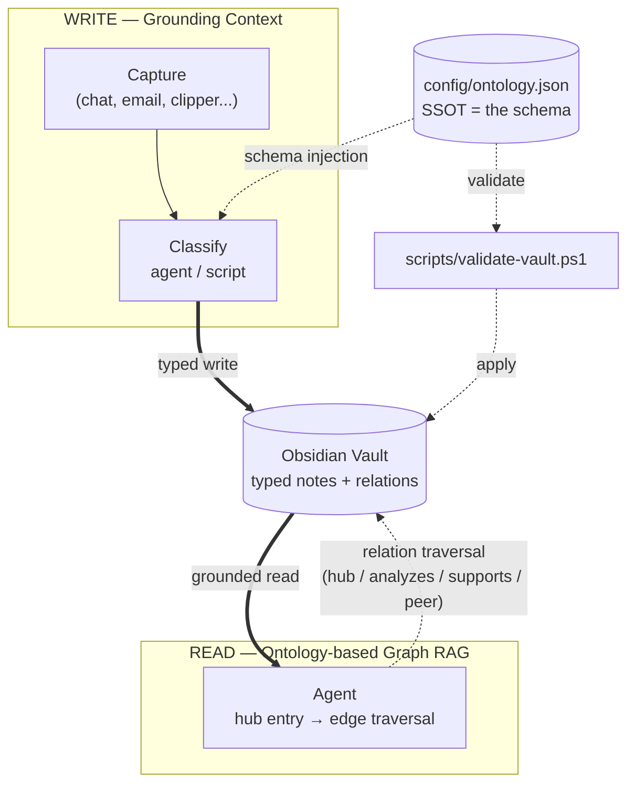

# Obsidian Ontology

**A schema-enforced knowledge graph inside a plain Obsidian vault — so an AI agent can retrieve by traversing typed relations instead of guessing at full-text search.**

Notes are classified against a single source of truth, linked with *typed* edges (`analyzes::`, `supports::`, `peer::`), and validated by script. The same ontology that constrains writing is what makes reading precise.

https://github.com/user-attachments/assets/087006cd-fdc7-47d1-bc26-399db4821cd9

---

## The problem

Ask an agent *"summarize this quarter's contracts"* and it has no idea which file, which column, which of your three words for the same thing. Sales says *contract*, finance says *booking*, the floor says *deal*. Humans paper over this with context. Agents cannot.

The same gap shows up in a personal vault. A thousand notes linked with untyped `[[wikilinks]]` is a pile, not a graph. `[[NVIDIA]]` and `[[NVDA]]` become two nodes for one company. An agent asked *"what supports this thesis?"* has to fall back to keyword search and hope.

**This repo fixes that at the schema level.**

---

## How it works

Two directions, one ontology:

| Direction | Role | What it is |
|---|---|---|
| **Write** (capture, classify) | Constrains what can be created | Grounding context — schema enforcement |
| **Read** (review, query) | Traverses typed edges from hub nodes | Ontology-based Graph RAG |

**Legend:** — solid = data flow &nbsp;&nbsp; ┄┄ dashed = governance / schema



**This is not vector RAG.** No embeddings, no similarity search. Retrieval is symbolic: enter at a hub, walk typed edges, filter on frontmatter. For a curated vault this is more precise than cosine distance — and it can answer questions embeddings cannot, such as *"every note that `supports::` this thesis but was written before that date."*

---

## What makes it hold together

Four properties, in the order they matter:

### 1. Single source of truth, read at runtime

[`config/ontology.json`](config/ontology.json) defines every legal value: domains, sectors, industries, sources, relation types, aliases, hubs. Scripts and the ingestion pipeline **read it at runtime** — no code generation, no constants to regenerate, no redeploy. Add a hub, and the next run already knows about it.

### 2. Validation at write time, not cleanup time

Classification is checked *before* a note lands. A note that violates the schema is quarantined into `0_Inbox/` with a warning callout rather than filed as if it were canonical. Bad data never gets to impersonate good data.

### 3. Entity resolution

`aliases` maps every known surface form to one canonical node — `Nvidia`, `NVIDIA`, `엔비디아` all resolve to `TICKER_A` at write time. One real-world entity, one graph node. Adding an alias is a one-line edit to the SSOT.

### 4. Graph integrity is measured, not assumed

The validator reports two failure modes most link-based systems never surface:

- **dangling** — a typed edge pointing at a note that does not exist
- **orphan** — a note with zero inbound *and* zero outgoing links, unreachable by any traversal

---

## Try it in 30 seconds

Requires PowerShell 5.1+ (Windows built-in). No install, no dependencies.

```powershell
git clone https://github.com/<you>/obsidian-ontology
cd obsidian-ontology

# Validate the bundled sample vault
powershell -ExecutionPolicy Bypass -File .\scripts\validate-vault.ps1 `
  -VaultPath .\examples\sample-vault
```

Expected output — the sample vault ships with one deliberately broken note:

```
[3_Resources\Deliberately broken note.md]
  [WARN]  source 'newsletter' invalid (valid: telegram, blog, report, ...)
  [ERROR] industry 'Shipbuilding' invalid for sector 'Tech' (valid: Semiconductor, ...)

  Scanned: 3 notes
  Clean:   2
  ERROR:   1
  WARN:    2
```

Point it at your own vault:

```powershell
$env:OBSIDIAN_VAULT = "C:\path\to\your\vault"
powershell -ExecutionPolicy Bypass -File .\scripts\validate-vault.ps1
powershell -ExecutionPolicy Bypass -File .\scripts\validate-vault.ps1 -AutoFix   # apply safe fixes
```

---

## Repo layout

```
config/ontology.json          SSOT — every legal value lives here
scripts/
  validate-vault.ps1          schema + graph integrity validator (+ -AutoFix)
  sync-ontology.ps1           propagate SSOT into derived docs & dataview blocks
  rename-hub.ps1              rename a hub everywhere (links, file, SSOT, docs)
examples/sample-vault/        runnable 5-note vault, incl. one broken note
docs/
  architecture.md             the write/read duality in depth
  ontology-spec.md            entity types, attributes, relations, rules
  pipeline.md                 automated capture: message -> classified note
demo/demo.mp4                 screen recording
```

---

## Vault conventions

PARA + Zettelkasten. `para_type` decides the folder via `folderMap`:

| `para_type` | Folder | Meaning |
|---|---|---|
| `project` | `1_Projects/` | Has a goal and an end date |
| `area` | `2_Areas/` | Ongoing responsibility (a position, a domain) |
| `resource` | `3_Resources/` | Someone else's material |
| `zk` | `5_Zettelkasten/` | Your own thinking |

Authorship is the rule that keeps `resource` and `zk` apart: external author → `resource`, your own claim → `zk`.

Relations live in a `## Relations` section as inline fields, one per line:

```markdown
## Relations

hub:: [[AI]]
analyzes:: [[TICKER_A]]
supports:: [[Thesis note]]
```

Allowed relation types are per-domain (see `validRelationTypes`), so an `invest` note can use `holding::` while a `general` note cannot. Links are declared one-way; Dataview surfaces the reverse direction automatically via `inlinks`.

---

## Design notes

**Why not RDF/OWL?** Format, not substance. RDF buys interoperability with SPARQL, Fabric IQ, and ontology editors. JSON + frontmatter buys zero-dependency parsing from PowerShell and JavaScript, and edits that a human makes in one line. For a single vault the trade favors JSON — the concepts (entity, attribute, relation, cardinality) are identical either way.

**Known gaps**, kept honest:

- **Entity types are not declared.** `para_type` is a workflow bucket, not an entity type; the real entity typing sits implicitly in the hub list (companies, sectors, concepts, and projects all share one flat namespace). A `hub_type` field would fix this.
- **Relation range is unconstrained.** Relation *names* are validated per domain; relation *targets* are not checked against the hub registry.
- **No cardinality rules.** Nothing enforces "at most N hubs per note."

None of these hurt at single-vault scale. All of them start to hurt once several agents write into the same graph.

---

## License

MIT — see [LICENSE](LICENSE).
