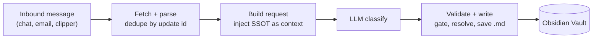

# Ingestion Pipeline (optional)

The vault and validator stand alone. This document describes the automated capture layer — how an inbound message becomes a classified, linked note without manual filing — so the pattern can be rebuilt on any orchestrator.

> No workflow export is included in this repo. Exported automation files typically embed bot tokens and API keys; the design is documented instead so you can rebuild it against your own credentials.

## Shape



## Stage 1 — Fetch and parse

Poll the source, parse each message, and deduplicate using the source's own cursor (an update id or equivalent) rather than tracking state yourself. Attachments are downloaded to an assets folder and referenced as embeds; images are **not** sent to the classifier, which keeps token cost flat regardless of attachment size.

## Stage 2 — Build the request

The step that makes classification reliable: **read the SSOT at runtime and inject it into the system prompt.**

```javascript
const cfg = JSON.parse(fs.readFileSync(CONFIG_PATH, 'utf8'));
// inject cfg.validSectors, cfg.validIndustries, cfg.hubList, ... into the prompt
```

The model is told the exact legal values rather than being asked to invent categories. Because the read happens per run, editing the SSOT changes classifier behavior on the next message — no prompt editing, no redeploy.

Keep a hardcoded fallback for when the read fails, and treat divergence between fallback and SSOT as tech debt to reconcile.

## Stage 3 — Classify

Ask a small, fast model for a strict JSON object:

| Field | Constraint |
|---|---|
| `para_type` | `resource` or `zk` only — authorship decides (external author → `resource`, your own claim → `zk`) |
| `domain` | from `validDomains` |
| `sector` / `industry` | from the injected lists, industry must match its sector |
| `title` | filename-safe, concise |
| `related` | hub links, from the injected `hubList` |
| `url` | extracted from the message |

Restricting `para_type` to two values is deliberate: `project` and `area` notes are hand-maintained master notes, and letting a classifier create them invites overwrites.

## Stage 4 — Validate and write

Four guards, in order. Each one exists because its absence caused a real failure.

**1. Write gate.** Re-validate the model's output against the SSOT *before* choosing a folder. On violation, write to `0_Inbox/` with a warning callout instead of the canonical folder. Misclassified notes never masquerade as verified ones. If the SSOT read fails, disable the gate rather than blocking capture — availability beats strictness for an inbox.

**2. Entity resolution.** Rewrite every relation target through `aliases`, exact-match only, so `[[Company A]]` is stored as `[[TICKER_A]]`. One entity, one node — enforced at the only moment it is cheap.

**3. Filename guard.** Check for an existing file before writing. On collision, divert to `0_Inbox/<title>-<timestamp>.md`. A classifier that happens to generate an existing title must never overwrite a master note.

**4. Timezone.** Stamp `created` in your local timezone, not UTC. Otherwise notes captured after midnight local get dated to the previous day, and every date-range query is quietly wrong.

## Emitted note

```markdown
---
title: "..."
para_type: resource
domain: invest
sector: Tech
industry: Semiconductor
source: telegram
url: "https://..."
tags: [invest, Report]
created: 2026-01-06
updated: 2026-01-06
---

<body>

## Related Notes

<dataview block>

## Relations

hub:: [[AI]]
```

Cross-note relations beyond hub links (`analyzes::`, `supports::`, `peer::`) are added during a weekly review pass. Automated capture is good at classification and bad at judging which existing note something supports — so that judgment stays human.

## Rebuild checklist

- [ ] Source polling with cursor-based dedupe
- [ ] SSOT read at runtime, with fallback
- [ ] Classification returning strict JSON
- [ ] Write gate → quarantine on violation
- [ ] Alias resolution on relation targets
- [ ] Filename collision guard
- [ ] Local-timezone date stamping
- [ ] Credentials in the orchestrator's secret store, never in code nodes
